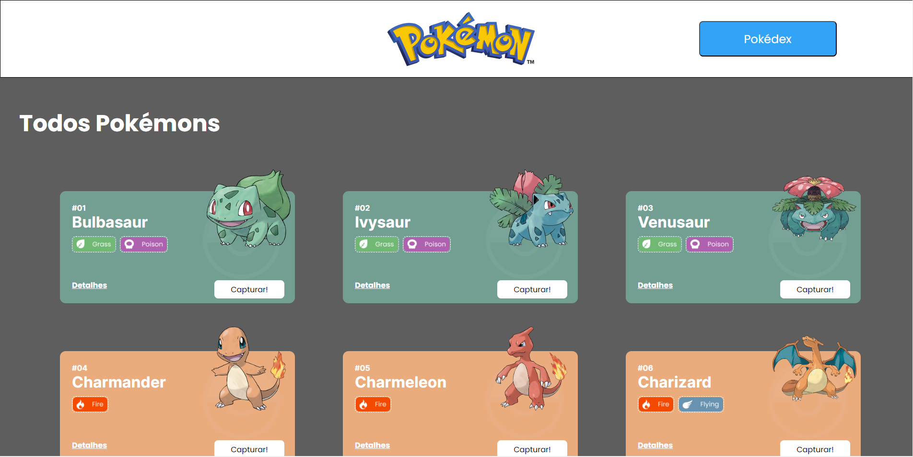
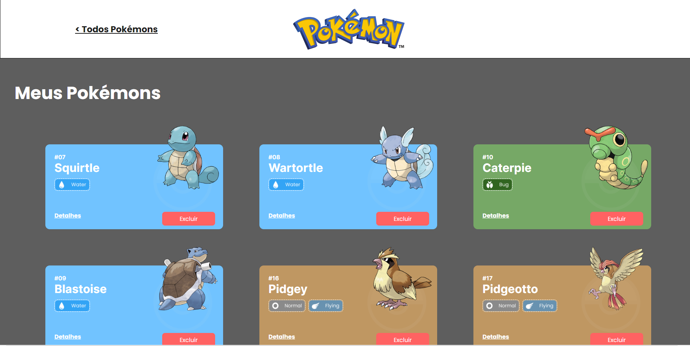
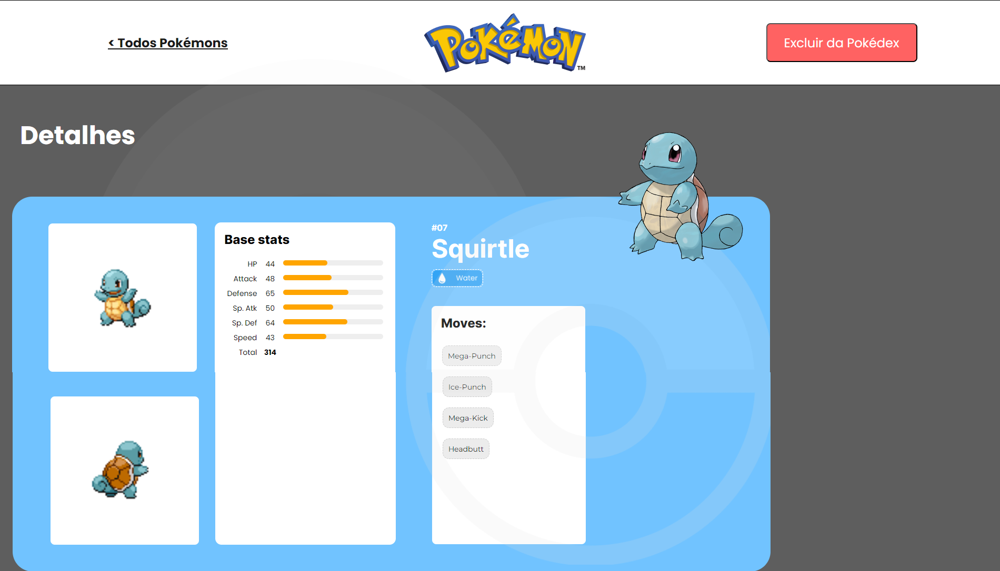

# Pokédex


Este projeto busca os primeiros 100 Pokémons na <a href="https://pokeapi.co/">PokeApi</a> e os apresenta em Cards na Home Page.
Escolha seus Pokémons favoritos e Capture-os na sua Pokédex!
Veja nos detalhes as principais Base stats e Moves de cada Pokémon.


## Índice

- <a href="#funcionalidades">Funcionalidades do Projeto</a>
- <a href="#layout">Layout</a>
- <a href="#demonstracao">Demonstração</a>
- <a href="#rodar">Como rodar este projeto?</a>
- <a href="#tecnologias">Tecnologias Utilizadas</a>
- <a href="#autoras">Pessoas Autoras</a>
- <a href="#passos">Próximos Passos</a>

## #Funcionalidades do Projeto

- [x] HomePage com Cards de Pokémons
- [x] Pokédex com Pokémons capturados
- [x] Detalhes do Pokémon

## Layout





## Demonstração

[Link para abrir o projeto no seu navegador]( https://conway-elowuttke-pokedex.surge.sh)

## Como rodar este projeto?

```
npm install
npm run start
```

## Tecnologias Utilizadas

1. React
2. Integração de API's
3. React Router
4. React Context
5. Axios
6. Styled-components

## Pessoas Autoras


[Eloísa Wuttke Madril](https://www.linkedin.com/in/eloisa-wuttke-madril/)

## Próximos Passos

- [ ] Responsividade
- [ ] Substituir alert por modal quando adicionar/remover Pokémon da Pokédex
- [ ] Utilizar LocalStorage para guardar Pokedex
